# Database

The application uses PostgreSQL (hosted on Neon serverless) with Drizzle ORM for type-safe database access.

## Client Setup

**File**: `src/modules/shared/infrastructure/database/client.ts`

- Uses `@neondatabase/serverless` HTTP driver for serverless-compatible connections
- Drizzle ORM wraps the connection with full schema mapping
- Exports a single `database` instance used across all repositories

## Schema Organization

Each module defines its own schema file:

```
src/modules/<module>/infrastructure/persistence/<module>.schema.ts
```

All module schemas are re-exported through a central file:

```
src/modules/shared/infrastructure/database/schema.ts
```

This central file is referenced by `drizzle.config.ts` for migration generation.

## Entity Relationship Diagram

```mermaid
erDiagram
    %% ── AUTH MODULE ──────────────────────────────────────────────
    user {
        uuid id PK
        text name
        text email UK
        boolean emailVerified
        text image
        text role
        boolean banned
        text banReason
        timestamp banExpires
        timestamp createdAt
        timestamp updatedAt
    }

    session {
        uuid id PK
        timestamp expiresAt
        text token UK
        text ipAddress
        text userAgent
        uuid userId FK
        uuid activeOrganizationId
        uuid impersonatedBy FK
        timestamp createdAt
        timestamp updatedAt
    }

    account {
        uuid id PK
        text accountId
        text providerId
        uuid userId FK
        text accessToken
        text refreshToken
        text idToken
        timestamp accessTokenExpiresAt
        timestamp refreshTokenExpiresAt
        text scope
        text password
        timestamp createdAt
        timestamp updatedAt
    }

    verification {
        uuid id PK
        text identifier
        text value
        timestamp expiresAt
        timestamp createdAt
        timestamp updatedAt
    }

    organization {
        uuid id PK
        text name
        text slug UK
        text logo
        text metadata
        timestamp createdAt
    }

    member {
        uuid id PK
        uuid userId FK
        uuid organizationId FK
        text role
        timestamp createdAt
    }

    invitation {
        uuid id PK
        text email
        uuid inviterId FK
        uuid organizationId FK
        text role
        text status
        timestamp expiresAt
        timestamp createdAt
    }

    user ||--o{ session : "has sessions"
    user ||--o{ account : "has accounts"
    user ||--o{ member : "belongs to orgs"
    user ||--o{ invitation : "sends invitations"
    organization ||--o{ member : "has members"
    organization ||--o{ invitation : "has invitations"

    %% ── DOCTOR MODULE ────────────────────────────────────────────
    specialty {
        uuid id PK
        text name
        text color
    }

    doctor {
        uuid id PK
        uuid user_id FK "UK"
        uuid specialty_id FK
        text license_number
        text bio
        real score
        integer experience
        timestamp next_availability_generation
        timestamp created_at
        timestamp updated_at
    }

    price {
        uuid id PK
        uuid doctor_id FK
        real amount
        enum payment_mode "PREPAID | POSTPAID | CREDIT"
    }

    office_address {
        uuid id PK
        uuid doctor_id FK
        text address
        jsonb location "lat, lng"
        timestamp created_at
        timestamp updated_at
    }

    education {
        uuid id PK
        uuid doctor_id FK
        text title
        text institution
        timestamp graduated_at
        timestamp created_at
        timestamp updated_at
    }

    user ||--o| doctor : "is a doctor"
    specialty ||--o{ doctor : "specializes"
    doctor ||--o{ price : "has prices"
    doctor ||--o{ office_address : "has offices"
    doctor ||--o{ education : "has education"

    %% ── PATIENT MODULE ───────────────────────────────────────────
    patient {
        uuid id PK
        uuid user_id FK
        text email
        text name
        timestamp birth_date
        enum gender "MAN | WOMAN | OTHER"
        timestamp created_at
        timestamp updated_at
    }

    contact_info {
        uuid id PK
        uuid patient_id FK
        text phone
        text address
        timestamp created_at
        timestamp updated_at
    }

    vitals {
        uuid id PK
        uuid patient_id FK
        real blood_pressure
        real heart_rate
        real respiratory_rate
        real oxygen_saturation
        real temperature
        timestamp created_at
        timestamp updated_at
    }

    physical_information {
        uuid id PK
        uuid patient_id FK
        real height
        real weight
        text blood_type
        real body_mass_index
        timestamp created_at
        timestamp updated_at
    }

    user ||--o| patient : "is a patient"
    patient ||--o{ contact_info : "has contacts"
    patient ||--o{ vitals : "has vitals"
    patient ||--o| physical_information : "has physical info"

    %% ── APPOINTMENT MODULE ───────────────────────────────────────
    appointment {
        uuid id PK
        uuid organization_id
        uuid patient_id FK
        uuid doctor_id FK
        timestamp date
        time hour
        text motive
        enum type "CONSULTATION | FOLLOW_UP | ..."
        enum mode "ONLINE | IN_PERSON"
        enum status "SCHEDULED | IN_PROGRESS | ..."
        timestamp created_at
        timestamp updated_at
    }

    appointment_rating {
        uuid id PK
        uuid appointment_id FK "UK"
        uuid patient_id FK
        uuid doctor_id FK
        integer score
        timestamp created_at
        timestamp updated_at
    }

    appointment_note {
        uuid id PK
        text note
        uuid appointment_id FK
        timestamp created_at
        timestamp updated_at
    }

    appointment_payment {
        uuid id PK
        uuid appointment_id FK "UK"
        integer amount
        integer current_paid_amount
        text currency
        enum payment_mode "PREPAID | POSTPAID | CREDIT"
        enum payment_method "CASH | CREDIT_CARD | ..."
        enum payment_status "PENDING | COMPLETED | ..."
        timestamp payment_date
    }

    doctor ||--o{ appointment : "attends"
    patient ||--o{ appointment : "books"
    appointment ||--o| appointment_rating : "has rating"
    appointment ||--o{ appointment_note : "has notes"
    appointment ||--o| appointment_payment : "has payment"

    %% ── PRESCRIPTION MODULE ──────────────────────────────────────
    prescription {
        uuid id PK
        uuid patient_id FK
        uuid doctor_id FK
        text observation
        timestamp created_at
        timestamp updated_at
    }

    medication {
        uuid id PK
        uuid prescription_id FK
        uuid patient_id FK
        text name
        real dosage
        text dosage_unit
        text frequency
        text administration_method
        json alternatives
        timestamp start_date
        timestamp end_date
        text notes
        enum state "PENDING | ACTIVE | PAUSED | COMPLETED"
        timestamp created_at
        timestamp updated_at
    }

    medication_reminder {
        uuid id PK
        uuid medication_id FK "UK"
        uuid prescription_id FK
        uuid patient_id FK
        timestamp scheduled_time
        boolean is_taken
        boolean forgotten
        timestamp taken_at
        timestamp created_at
        timestamp updated_at
    }

    doctor ||--o{ prescription : "prescribes"
    patient ||--o{ prescription : "receives"
    prescription ||--o{ medication : "contains"
    medication ||--o| medication_reminder : "has reminder"
    prescription ||--o{ medication_reminder : "tracks reminders"

    %% ── SCHEDULE MODULE ──────────────────────────────────────────
    schedule {
        uuid id PK
        uuid doctor_id FK "UK"
        integer appointment_duration
        integer max_appointments_per_day
        timestamp next_availability_generation
        timestamp created_at
        timestamp updated_at
    }

    schedule_day {
        uuid id PK
        uuid schedule_id FK
        integer day
        time start_hour
        time end_hour
    }

    availability_slot {
        uuid id PK
        uuid doctor_id FK
        timestamp date
        time hour
        enum state "TAKEN | AVAILABLE"
        timestamp created_at
        timestamp updated_at
    }

    doctor ||--o| schedule : "has schedule"
    schedule ||--o{ schedule_day : "has days"
    doctor ||--o{ availability_slot : "has slots"

    %% ── DIAGNOSIS MODULE ─────────────────────────────────────────
    diagnosis {
        uuid id PK
        text summary
        text cie_code
        enum certainty "PRESUMPTIVE | DIFFERENTIAL | ..."
        enum state "ACTIVE | REMISSION | ..."
        enum income "INCOME | PRINCIPAL | ..."
        enum type "ALLERGY | CHRONIC | ..."
        uuid patient_id FK
        timestamp created_at
        timestamp updated_at
    }

    patient ||--o{ diagnosis : "has diagnoses"

    %% ── MEDICAL RECORD MODULE ────────────────────────────────────
    medical_record {
        uuid id PK
        uuid patient_id FK
        uuid doctor_id FK
        enum type "DIAGNOSIS | PRESCRIPTION | ..."
        text title
        text description
        timestamp date
        enum priority "LOW | NORMAL | HIGH | CRITICAL"
        text[] tags
        enum status "FINAL | DRAFT | ..."
        jsonb attachments
    }

    patient ||--o{ medical_record : "has records"
    doctor ||--o{ medical_record : "authors"

    %% ── CHAT MODULE ──────────────────────────────────────────────
    chat {
        uuid id PK
        text title
        uuid user_id FK
        jsonb messages
        timestamp date
        text status
    }

    user ||--o{ chat : "has chats"
```



### Module Schemas

| Module | Tables |
|--------|--------|
| auth | user, session, account, verification, organization, member, invitation |
| appointment | appointment, appointment_rating, appointment_note, appointment_payment |
| doctor | doctor, specialty, price, office_address, education |
| patient | patient, contact_info, physical_information, vitals |
| prescription | prescription, medication, medication_reminder |
| schedule | schedule, schedule_day, availability_slot |
| chat-agent | chat, chat_message |
| diagnosis | diagnosis |
| medical-record | medical_record |

### PostgreSQL Enums

The schema uses PostgreSQL native enums for type safety:

- `appointment_status`: SCHEDULED, IN_PROGRESS, CANCELLED, FINISHED
- `appointment_type`: CONSULTATION, FOLLOW_UP, CHECK_UP, EMERGENCY, PROCEDURE
- `appointment_mode`: ONLINE, IN_PERSON
- `appointment_payment_mode`: PREPAID, POSTPAID, CREDIT
- `appointment_payment_method`: CASH, CREDIT_CARD, DEBIT_CARD, BANK_TRANSFER, MOBILE_PAYMENT, CHECK, OTHER
- `appointment_payment_status`: PENDING, COMPLETED, FAILED, REFUNDED, PARTIAL
- `patient_gender`: MAN, WOMAN, OTHER
- `medication_state`: PENDING, ACTIVE, PAUSED, COMPLETED
- `price_payment_mode`: PREPAID, POSTPAID, CREDIT
- `slot_state`: TAKEN, AVAILABLE
- `diagnosis_certainty`: PRESUMPTIVE, DIFFERENTIAL, DEFINITIVE, DISCARD
- `diagnosis_state`: ACTIVE, REMISSION, CURED, RECURRENT, DECEASED
- `diagnosis_income`: INCOME, PRINCIPAL, SECONDARY, EGRESS
- `diagnosis_type`: ALLERGY, CHRONIC, ACUTE, FAMILY_HISTORY, SOCIAL_HISTORY
- `medical_record_type`: DIAGNOSIS, PRESCRIPTION, NOTE, LAB_RESULT, IMAGING_RESULT, IMMUNIZATION, PROCEDURE, PLAN, OTHER
- `medical_record_priority`: LOW, NORMAL, HIGH, CRITICAL
- `medical_record_status`: FINAL, DRAFT, AMENDED, CORRECTED, APPENDED

## Migrations

- **Output directory**: `src/modules/shared/infrastructure/database/migrations/`
- **Generation**: `npm run database:build` (runs `drizzle-kit generate`)
- **Execution**: `npm run database:migrate` (runs `drizzle-kit migrate`)
- **Inspection**: `npm run database:dev` (Drizzle Studio on port 3001)

Migrations are SQL files generated by Drizzle Kit. Each migration is numbered sequentially (0000, 0001, etc.) with a descriptive slug.

## Drizzle Configuration

**File**: `drizzle.config.ts`

```typescript
export default defineConfig({
  out: "./src/modules/shared/infrastructure/database/migrations",
  schema: "./src/modules/shared/infrastructure/database/schema.ts",
  dialect: "postgresql",
  dbCredentials: {
    url: process.env.DATABASE_URL,
  },
});
```

## Repository Pattern

Each module defines a repository interface in its domain layer and a Drizzle implementation in its infrastructure layer:

```
domain/<module>-repository.ts          → Interface
infrastructure/persistence/drizzle-<module>-repository.ts → Implementation
```

Repositories use Drizzle's query builder for type-safe SQL generation and return domain objects (aggregates/entities), not raw database rows.

## Environment

- `DATABASE_URL` - Neon PostgreSQL connection string (validated via `@t3-oss/env-core`)
